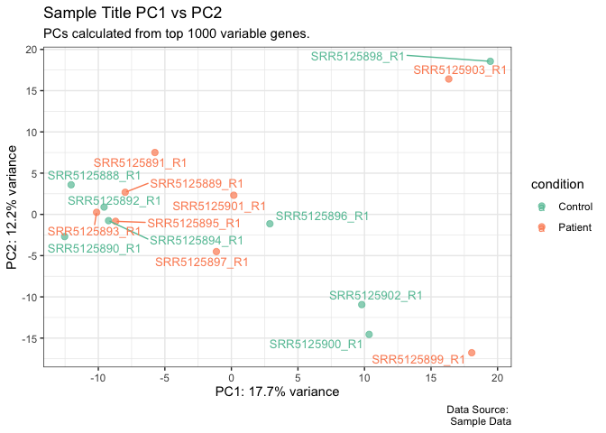
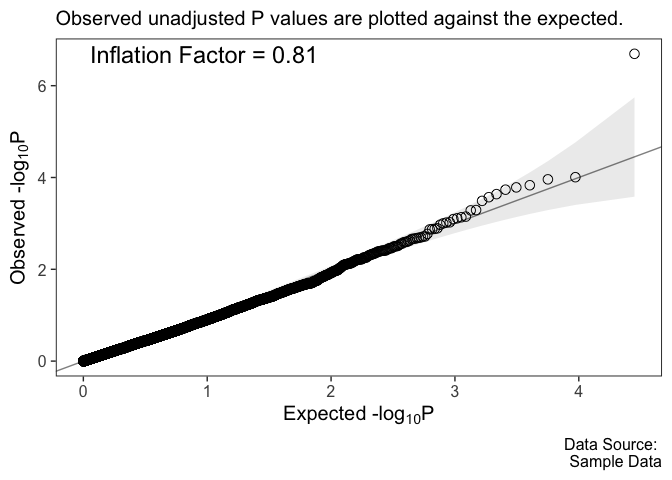
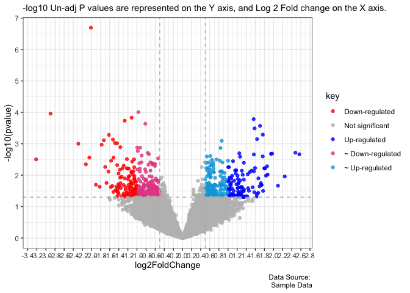
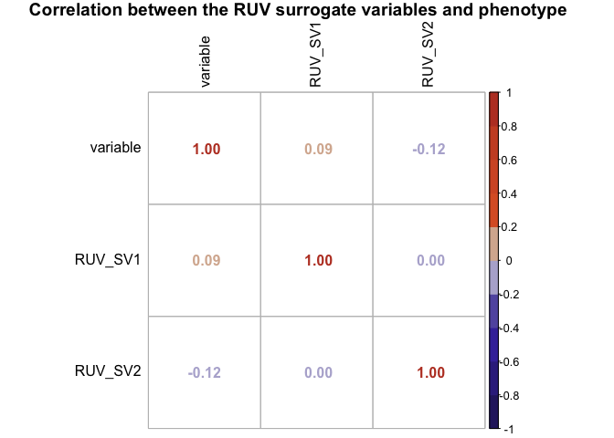

<!-- README.md is generated from README.Rmd. Please edit that file -->

# rnaseqviz

<!-- badges: start -->
<!-- badges: end -->

The goal of rnaseqviz is to sorting, organizing, and visualizing RNA seq
results generated using . This package is developed to be used in the
Aouizerat Lab.

## Installation

You can install the development version of rnaseqviz from
[GitHub](https://github.com/) with:

``` r
# install.packages("devtools")
devtools::install_github("kra277/rnaseqviz")
```

## Example

Below are some basic examples of how to execute the commands:

### PCA Plot

``` r
# Prep the normalized count data 
sample_pca_data <- pca_prep(sample_vst_dd, "Group")
```

``` r
# Give the title and a caption
ana <- "Sample Title PC1 vs PC2"
caption <- "Data Source: \n Sample Data"

# Plot the graph
rna_pca_plot(sample_pca_data)
```



### QQ plot

``` r
# Give the title and a caption
ana <- "Sample Title PC1 vs PC2"
caption <- "Data Source: \n Sample Data"

# Given DEG P values
rna_qq_plot(sample_clean_deg$pvalue)
```



### Volcano plot

``` r
# Give the title and a caption
ana <- "Sample Title PC1 vs PC2"
caption <- "Data Source: \n Sample Data"

# Given DEG dataframe
rna_vol_plot(df = sample_clean_deg, p = pvalue, val = 0.05)
```



### Correlation plots

Correlation plots for batch corrected results

``` r
library(RUVSeq)
```

Perform RUV seq to get surrogate variables

``` r
# Perform RUV batch corrections for Hidden batch effects
set <- newSeqExpressionSet(counts(sample_deseq_data))
idx  <- rowSums(counts(set) > 10) >= 1
set  <- set[idx, ]
set <- betweenLaneNormalization(set, which="upper")
not.sig <- rownames(sample_clean_deg)[which(sample_clean_deg$pvalue > .1)]
empirical <- rownames(set)[ rownames(set) %in% not.sig ]
set <- RUVg(set, empirical, k=2)
```

Plot the correlation between surrogate variables and phenotype

``` r
bc_corr_plot(bc_method = "ruv", var_int = "Group", font_size = 1)
```


